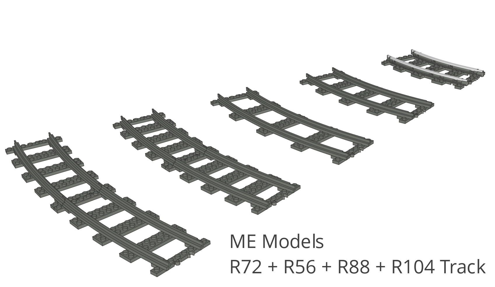

# L-Gauge.org LDraw Part Libraries

This repository contains add-on parts for LDraw compatible software tools. <a href="http://www.ldraw.org/">LDraw</a> is an open standard for LEGO® CAD software tools for defining parts and models. Parts can be built from primitive 3D shape objects such as lines, triangles, quads, etc. Models can be built from a hierarchy of parts supporting multi-instance sub-assemblies. The LDraw eco-system has produced software tools used for creating building instructions, high fidelity 3D rendering, animations, etc.

This repository is a work in progress.

## Links

<li><a href="http://l-gauge.org/">L-Gauge.org</a></li>
<li><a href="http://www.ldraw.org/">LDraw.org</a></li>

---

<small>LEGO® is a trademark of the LEGO® Group of companies which does not sponsor, authorize or endorse this site.</small>

