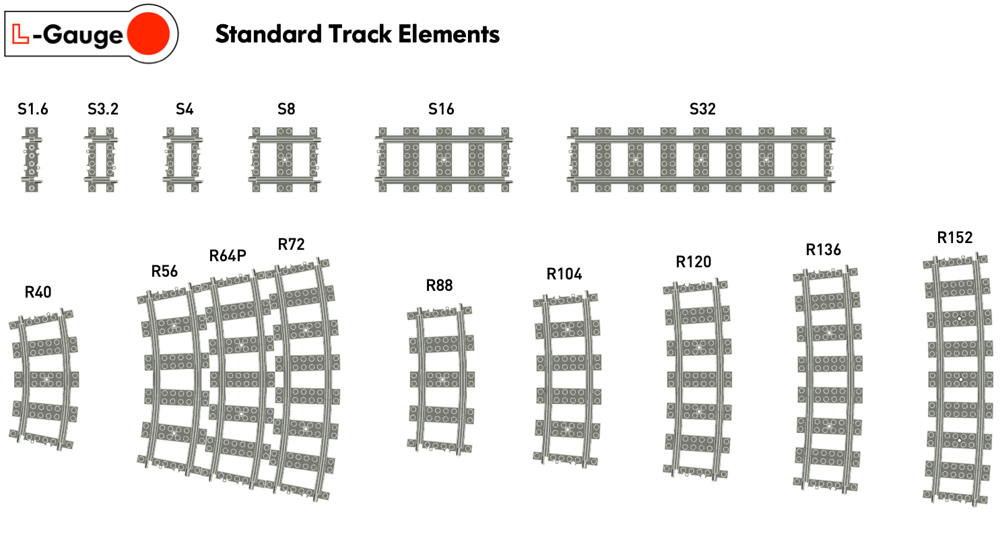

# L-Gauge.org Standard RC Track LDraw Part Library

This repository contains add-on parts for LDraw compatible software tools. <a href="http://www.ldraw.org/">LDraw</a> is an open standard for LEGO® CAD software tools for defining parts and models. 

This library contains high fidelity LDraw models for L-Gauge standard track elements including:

- Straights:  S1.6, S3.2, S4, S8, S16, S32
- Curves:  R40, R56, R64P, R72, R88, R104, R120, R136, R152

## Installation 

To use this library, copy the contents of the `ldraw` folder into the `Unofficial/parts` folder your LDraw library path.

## References

- [LDraw.org](https://www.ldraw.org) - Official maintainer of the LDraw file format specification and the LDraw official part library.
- [L-Gauge.org](http://l-gauge.org) - L-Gauge model train system reference site

### Lego CAD Tools

- [Bricklink stud.io](https://www.bricklink.com/v3/studio/download.page) new and modern design tool designed and maintained by Bricklink
- [LeoCAD](https://www.leocad.org) cross platform tool
- [MLCAD](http://mlcad.lm-software.com) for Windows
- [Bricksmith](http://bricksmith.sourceforge.net) for macOS by Allen Smith (no longer maintained)
- [LDView](http://ldview.sourceforge.net) real-time 3D viewer for LDraw models

### LPub Instructions Tools

- Original [LPub](http://lpub.binarybricks.nl) publishing tool by Kevin Clague
- [LPub3D](https://trevorsandy.github.io/lpub3d/) successor to LPub by Trevor Sandy
- [Manual](https://sites.google.com/site/workingwithlpub/lpub-4) for Legacy LPub 4 tool (last version by Kevin Clague)

### See Also

- Fx Bricks [9V/Metal Fx Track System](https://github.com/fx-bricks/fx-track-ldraw) repository for LDraw models of 9V/metal track elements

---

<small>LEGO® is a trademark of the LEGO® Group of companies which does not sponsor, authorize or endorse this site.</small>

